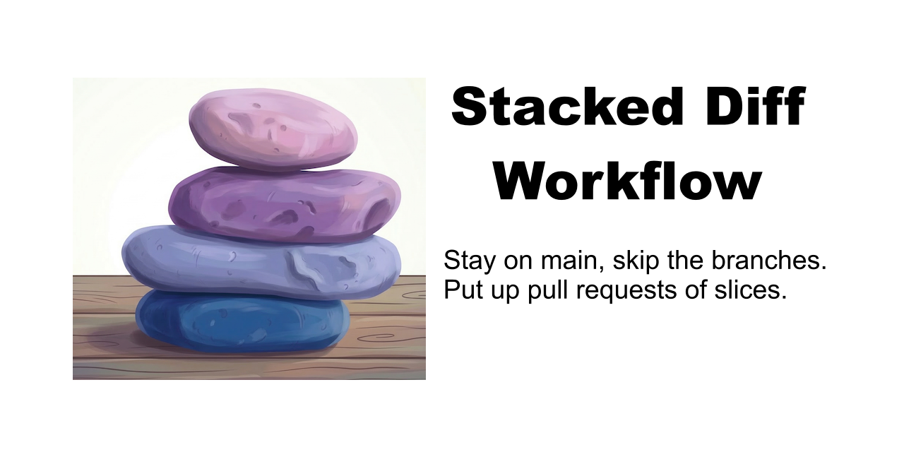
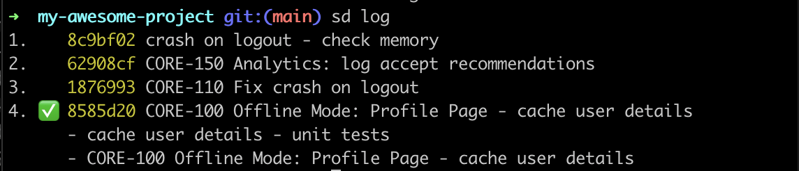

<p align="center">
  
</p>

`sd` is a CLI for [stacked diff workflows](https://newsletter.pragmaticengineer.com/p/stacked-diffs) on GitHub. It manages git commits, branches, and PRs through the GitHub CLI so you can:

- Break down large changes into several small, focused PRs.
- Work on multiple streams of work without switching branches.
- Keep local-only commits (e.g. debug logging) that are never pushed.
- Create and update pull requests quickly.
- Automatically add reviewers once PR checks pass.

Once you experience stacked diffs, you won't want to go back.

# Installation

## Mac

*Optional: As this is a CLI, do yourself a favor and install [iTerm](https://iterm2.com/) and [zsh](https://ohmyz.sh/), as they make working from the command line more pleasant.*

```bash
# Install Github CLI.
brew install gh
# Setup login for Github CLI
gh auth login
# Install plugin
gh extensions install slackhq/gh-stacked-diff
# Add a shell function to make it faster to use.
# For example if using zsh (note: must be a function and not an alias for shell completions to work):
echo 'sd() { gh stacked-diff "$@"; }' >> ~/.zshrc
# Enable shell completions for zsh:
echo 'eval "$(sd completion zsh)"' >> ~/.zshrc
source ~/.zshrc
```

## Windows

1. Install [Git and Git Bash](https://gitforwindows.org/)
2. Install [Github CLI](https://cli.github.com/). Winget is possible: `winget install --id GitHub.cli`
3. Authenticate gh and install plugin:

      ```bash
      gh auth login
      # Install plugin
      gh extensions install slackhq/gh-stacked-diff
      # Add a shell function to make it faster to use.
      # For example if using Git Bash:
      echo 'sd() { gh stacked-diff "$@"; }' >> ~/.bashrc
      # Enable shell completions for bash:
      echo 'eval "$(sd completion bash)"' >> ~/.bashrc
      source ~/.bashrc
      ```

# Command Line Interface

| Command | Description |
| --- | --- |
| [`add-reviewers`](#add-reviewers) | Add reviewers to Pull Request on Github once its checks have passed |
| [`branch-name`](#branch-name) | Outputs branch name of commit |
| [`checkout`](#checkout) | Checks out branch associated with commit indicator |
| [`code-owners`](#code-owners) | Outputs code owners for all of the changes in branch |
| [`completion`](#completion) | Generate the autocompletion script for the specified shell |
| [`log`](#log) | Displays git log of your changes |
| [`migrate`](#migrate) | Migrates any work-in-progress branches to main |
| [`new`](#new) | Create a new pull request from a commit on main |
| [`prs`](#prs) | Lists all Pull Requests you have open |
| [`rebase-main`](#rebase-main) | Bring your main branch up to date with remote |
| [`replace-commit`](#replace-commit) | Replaces a commit on main branch with its associated branch |
| [`replace-conflicts`](#replace-conflicts) | For failed rebase: replace changes with its associated branch |
| [`update`](#update) | Add commits from main to an existing PR |
| [`wait-for-merge`](#wait-for-merge) | Waits for a pull request to be merged |
| [`worktree-move`](#worktree-move) | Cherry-pick commits from secondary worktree to main worktree |

See [Global Flags](#global-flags) for flags available on all commands.

## Basic Commands

### log

Shows your local commits that haven't been pushed to remote. Each entry includes a list index and commit hash that other commands accept as a commit indicator (alternative to using their interactive UI).

- ✅ indicates the commit has an associated PR.
- Indented lines show additional commits on the same branch.
- With git worktrees, each worktree's commits are shown in a separate section.



<details>
<summary><code>sd log --help</code></summary>

```
Displays summary of the git commits on current branch that are not
in the remote branch.

Useful to view list indexes, or copy commit hashes, to use for the
commitIndicator required by other commands.

A ✅ means that there is a PR associated with the commit (actually it
means there is a branch, but having a branch means there is a PR when
using this workflow). If there is more than one commit on the
associated branch, those commits are also listed (indented under
their associated commit summary).

A 🟡 means that multiple commits have the same subject.
Change the subjects to differentiate commits.

Usage:
  sd log [flags]

Flags:
  -h, --help     help for log
  -p, --poll     Keep polling for status updates. Implies --status.
                 Press Esc or Ctrl+C to exit.
  -s, --status   Show PR status including checks, approvals, and state.
                 Only supported on the main branch.

Global Flags:
  -c, --config stringToString   Set a config value as key=value (see Global Flags)
  -l, --log-level string        Log level: debug, info, warn, error
```

</details>

### new

Creates a PR from a commit on your local main branch. It cherry-picks the commit onto a new branch (named after the commit summary) and opens a PR via the GitHub CLI.

Use `--reviewers` to automatically add reviewers once checks pass.


<details>
<summary><code>sd new --help</code></summary>

```
Create a new PR with a cherry-pick of the given commit indicator.

This command first creates an associated branch, (with a name based
on the commit summary), and then uses Github CLI to create a PR.

Can also add reviewers once PR checks have passed, see "--reviewers" flag.

Ticket Number:

If you prefix a (Jira-like formatted) ticket number to the git commit
summary then the "Ticket" section of the PR description will be 
populated with it.

For example:

"CONV-9999 Add new feature"

Templates:

The Pull Request Title, Body (aka Description), and Branch Name are
created from golang templates.

The default templates are:

   branch-name.template:      templates/config/branch-name.template
   pr-description.template:   templates/config/pr-description.template
   pr-title.template:         templates/config/pr-title.template

To change a template, copy the default from templates/config/ into
~/.gh-stacked-diff/ and modify contents.

The possible values for the templates are:

   CommitBody                   Body of the commit message
   CommitSummary                Summary line of the commit message
   CommitSummaryCleaned         Summary line of the commit message without
                                spaces or special characters
   CommitSummaryWithoutTicket   Summary line of the commit message without
                                the prefix of the ticket number
   FeatureFlag                  Value passed to feature-flag flag
   TicketNumber                 Jira ticket as parsed from the commit summary
   TicketUrlPattern             URL for the ticket, with {TicketNumber}
                                replaced by the actual ticket number.
                                Configured via config.yaml or --config.
   Username                     Name as parsed from git config email.
   UsernameCleaned              Username with dots (.) converted to dashes (-).

Usage:
  sd new [commitIndicator] [flags]

Flags:
  -b, --base string           Base branch for Pull Request. Default is main
  -d, --draft                 Whether to create the PR as draft (default true)
  -f, --feature-flag string   Value for FEATURE_FLAG in PR description
  -h, --help                  help for new
  -i, --indicator string      Indicator type to use to interpret commitIndicator:
                                 commit   a commit hash, can be abbreviated,
                                 pr       a github Pull Request number,
                                 list     the order of commit listed in the git log, as indicated
                                          by "sd log"
                                 guess    the command will guess the indicator type:
                                    Number between 0 and 99:       list
                                    Number between 100 and 999999: pr
                                    Otherwise:                     commit
                               (default "guess")
  -m, --merge                 Enable auto-merge (squash) on the PR via Github CLI.
                              Implies marking the PR as ready for review.
      --min-checks int        Minimum number of checks to wait for before verifying that checks
                              have passed before adding reviewers. It takes some time for checks
                              to be added to a PR by Github, and if you add-reviewers too soon it
                              will think that they have all passed. Default of -1 means to use 4 
                              or the average number of checks of merged PRs, whatever is less. (default -1)
  -r, --reviewers string      Comma-separated list of Github usernames to add as reviewers once
                              checks have passed.
  -s, --silent                Whether to use voice output (false) or be silent (true) to notify that reviewers have been added.

Global Flags:
  -c, --config stringToString   Set a config value as key=value (see Global Flags)
  -l, --log-level string        Log level: debug, info, warn, error
```

</details>

##### Note on Commit Messages

Keep commit summaries to a [reasonable length](https://www.midori-global.com/blog/2018/04/02/git-50-72-rule) since they become the branch name (truncated to 120 characters). Use the [commit body](https://stackoverflow.com/questions/40505643/how-to-do-a-git-commit-with-a-subject-line-and-message-body/40506149#40506149) for additional detail.

### update

Adds commits from your local main branch to an existing PR.

Use `--reviewers` to automatically add reviewers once checks pass.


<details>
<summary><code>sd update --help</code></summary>

```
Add commits from local main branch to an existing PR.

Can also add reviewers once PR checks have passed, see "--reviewers" flag.

Note: git hooks (pre-commit, etc.) are bypassed during the local rebase. This
is safe because the resulting commits are cherry-picked onto the PR branch and
pushed, which runs hooks normally.

Usage:
  sd update [PR commitIndicator [fixup commitIndicator...]] [flags]

Flags:
  -h, --help               help for update
  -i, --indicator string   Indicator type to use to interpret commitIndicator:
                              commit   a commit hash, can be abbreviated,
                              pr       a github Pull Request number,
                              list     the order of commit listed in the git log, as indicated
                                       by "sd log"
                              guess    the command will guess the indicator type:
                                 Number between 0 and 99:       list
                                 Number between 100 and 999999: pr
                                 Otherwise:                     commit
                            (default "guess")
  -m, --merge              Enable auto-merge (squash) on the PR via Github CLI.
                           Implies marking the PR as ready for review.
      --min-checks int     Minimum number of checks to wait for before verifying that checks
                           have passed before adding reviewers. It takes some time for checks
                           to be added to a PR by Github, and if you add-reviewers too soon it
                           will think that they have all passed. Default of -1 means to use 4 
                           or the average number of checks of merged PRs, whatever is less. (default -1)
  -r, --reviewers string   Comma-separated list of Github usernames to add as reviewers once
                           checks have passed.
  -s, --silent             Whether to use voice output (false) or be silent (true) to notify that reviewers have been added.

Global Flags:
  -c, --config stringToString   Set a config value as key=value (see Global Flags)
  -l, --log-level string        Log level: debug, info, warn, error
```

</details>

### add-reviewers

Adds reviewers to a PR once its checks pass. If the PR is a draft, it is automatically marked as "Ready for Review" first.

<details>
<summary><code>sd add-reviewers --help</code></summary>

```
Add reviewers to Pull Request on Github once its checks have passed.

If PR is marked as a Draft, it is first marked as "Ready for Review".

Usage:
  sd add-reviewers [commitIndicator...] [flags]

Flags:
  -h, --help               help for add-reviewers
  -i, --indicator string   Indicator type to use to interpret commitIndicator:
                              commit   a commit hash, can be abbreviated,
                              pr       a github Pull Request number,
                              list     the order of commit listed in the git log, as indicated
                                       by "sd log"
                              guess    the command will guess the indicator type:
                                 Number between 0 and 99:       list
                                 Number between 100 and 999999: pr
                                 Otherwise:                     commit
                            (default "guess")
  -m, --merge              Enable auto-merge (squash) on the PR via Github CLI.
                           Implies marking the PR as ready for review.
      --min-checks int     Minimum number of checks to wait for before verifying that checks
                           have passed before adding reviewers. It takes some time for checks
                           to be added to a PR by Github, and if you add-reviewers too soon it
                           will think that they have all passed. Default of -1 means to use 4 
                           or the average number of checks of merged PRs, whatever is less. (default -1)
  -r, --reviewers string   Comma-separated list of Github usernames to add as reviewers once
                           checks have passed.
  -s, --silent             Whether to use voice output (false) or be silent (true) to notify that reviewers have been added.
  -w, --when-checks-pass   Poll until all checks pass before adding reviewers (default true)

Global Flags:
  -c, --config stringToString   Set a config value as key=value (see Global Flags)
  -l, --log-level string        Log level: debug, info, warn, error
```

</details>

## Commands for Rebasing and Fixing Merge Conflicts

### rebase-main

Rebases your local main with origin/main, automatically dropping commits whose PRs have already been merged. For closed (but not merged) PRs, you are prompted before dropping.

This saves you from manually resolving conflicts with commits that have already been merged but differ slightly from your local copy (e.g. due to edits made in the GitHub web UI).

<details>
<summary><code>sd rebase-main --help</code></summary>

```
Rebase with origin/main, dropping any commits who's associated
branches have been merged or closed.

Commits from merged PRs are automatically dropped. For commits from closed
(not merged) PRs, you will be prompted to confirm before dropping them.

This avoids having to manually call "git reset --hard head" whenever
you have merge conflicts with a commit that has already been merged
but has slight variation with local main because, for example, a
change was made with the Github Web UI.

Note: git hooks (pre-commit, etc.) are bypassed during the rebase. This is
safe because commits must be cherry-picked onto a PR branch via "sd new" or
"sd update" before they can be pushed, which runs hooks normally.

Usage:
  sd rebase-main [flags]

Flags:
  -h, --help   help for rebase-main

Global Flags:
  -c, --config stringToString   Set a config value as key=value (see Global Flags)
  -l, --log-level string        Log level: debug, info, warn, error
```

</details>

### checkout

Checks out the branch associated with a commit. Useful when you need to merge just one branch with origin/main, investigate a CI failure, or make fixes directly on the branch.

After making changes, use `sd replace-commit` to sync them back to your local main.

<details>
<summary><code>sd checkout --help</code></summary>

```
Checks out the branch associated with commit indicator.

For when you want to merge only the branch with with origin/main,
rather than your entire local main branch, verify why 
CI is failing on that particular branch, or for any other reason.

After modifying the branch you can use "sd replace-commit" to sync local main.

Usage:
  sd checkout [commitIndicator] [flags]

Flags:
  -h, --help               help for checkout
  -i, --indicator string   Indicator type to use to interpret commitIndicator:
                              commit   a commit hash, can be abbreviated,
                              pr       a github Pull Request number,
                              list     the order of commit listed in the git log, as indicated
                                       by "sd log"
                              guess    the command will guess the indicator type:
                                 Number between 0 and 99:       list
                                 Number between 100 and 999999: pr
                                 Otherwise:                     commit
                            (default "guess")

Global Flags:
  -c, --config stringToString   Set a config value as key=value (see Global Flags)
  -l, --log-level string        Log level: debug, info, warn, error
```

</details>

### replace-commit

Replaces a commit on your local main branch with the squashed contents of its associated branch. Use this after making changes on a branch (e.g. fixing a CI failure) to bring those changes back to main.

<details>
<summary><code>sd replace-commit --help</code></summary>

```
Replaces a commit on main branch with the squashed contents of its
associated branch.

This is useful when you make changes within a branch, for example to
fix a problem found on CI, and want to bring the changes over to your
local main branch.

Usage:
  sd replace-commit [commitIndicator] [flags]

Flags:
  -h, --help                          help for replace-commit
  -i, --indicator string              Indicator type to use to interpret commitIndicator:
                                         commit   a commit hash, can be abbreviated,
                                         pr       a github Pull Request number,
                                         list     the order of commit listed in the git log, as indicated
                                                  by "sd log"
                                         guess    the command will guess the indicator type:
                                            Number between 0 and 99:       list
                                            Number between 100 and 999999: pr
                                            Otherwise:                     commit
                                       (default "guess")
      --on-cherry-pick-error string   Action when cherry-pick fails: prompt, rollback, or exit (default "prompt")

Global Flags:
  -c, --config stringToString   Set a config value as key=value (see Global Flags)
  -l, --log-level string        Log level: debug, info, warn, error
```

</details>

### replace-conflicts

During a failed rebase, replaces the conflicting uncommitted changes with the contents of the associated branch (diff between origin/main and HEAD).

<details>
<summary><code>sd replace-conflicts --help</code></summary>

```
During a rebase that failed because of merge conflicts, replace the
current uncommitted changes (merge conflicts), with the contents
(diff between origin/main and HEAD) of its associated branch.

Usage:
  sd replace-conflicts [flags]

Flags:
  -y, --confirm   Whether to automatically confirm to do this rather than ask for y/n input
  -h, --help      help for replace-conflicts

Global Flags:
  -c, --config stringToString   Set a config value as key=value (see Global Flags)
  -l, --log-level string        Log level: debug, info, warn, error
```

</details>

## Commands for Custom Scripting

### branch-name

Outputs the branch name for a given commit. Useful for custom scripts.

<details>
<summary><code>sd branch-name --help</code></summary>

```
Outputs the branch name for a given commit indicator.
Useful for your own custom scripting.

Usage:
  sd branch-name [commitIndicator] [flags]

Flags:
  -h, --help               help for branch-name
  -i, --indicator string   Indicator type to use to interpret commitIndicator:
                              commit   a commit hash, can be abbreviated,
                              pr       a github Pull Request number,
                              list     the order of commit listed in the git log, as indicated
                                       by "sd log"
                              guess    the command will guess the indicator type:
                                 Number between 0 and 99:       list
                                 Number between 100 and 999999: pr
                                 Otherwise:                     commit
                            (default "guess")

Global Flags:
  -c, --config stringToString   Set a config value as key=value (see Global Flags)
  -l, --log-level string        Log level: debug, info, warn, error
```

</details>

### wait-for-merge

Blocks until a pull request is merged. Poll interval is configurable via `--config pollInterval`. Useful for custom scripts.

<details>
<summary><code>sd wait-for-merge --help</code></summary>

```
Waits for a pull request to be merged. Poll interval is configurable via --config pollInterval.

Useful for your own custom scripting.

Usage:
  sd wait-for-merge [commitIndicator] [flags]

Flags:
  -h, --help               help for wait-for-merge
  -i, --indicator string   Indicator type to use to interpret commitIndicator:
                              commit   a commit hash, can be abbreviated,
                              pr       a github Pull Request number,
                              list     the order of commit listed in the git log, as indicated
                                       by "sd log"
                              guess    the command will guess the indicator type:
                                 Number between 0 and 99:       list
                                 Number between 100 and 999999: pr
                                 Otherwise:                     commit
                            (default "guess")
  -s, --silent             Whether to use voice output (false) or be silent (true) to notify that the PR has been merged.

Global Flags:
  -c, --config stringToString   Set a config value as key=value (see Global Flags)
  -l, --log-level string        Log level: debug, info, warn, error
```

</details>

## Other Commands

### code-owners

Lists the code owners for every file modified on your local branch compared to remote main.

<details>
<summary><code>sd code-owners --help</code></summary>

```
Outputs code owners for each file that has been modified
in the current local branch when compared to the remote main branch

Usage:
  sd code-owners [flags]

Flags:
  -h, --help   help for code-owners

Global Flags:
  -c, --config stringToString   Set a config value as key=value (see Global Flags)
  -l, --log-level string        Log level: debug, info, warn, error
```

</details>

### prs

Lists all of your open Pull Requests. Requires `gh auth login`.

<details>
<summary><code>sd prs --help</code></summary>

```
Lists all Pull Requests you have open.

You must be logged-in, via "gh auth login"

Usage:
  sd prs [flags]

Flags:
  -h, --help   help for prs

Global Flags:
  -c, --config stringToString   Set a config value as key=value (see Global Flags)
  -l, --log-level string        Log level: debug, info, warn, error
```

</details>

### migrate

Moves commits from existing feature branches onto main, preparing your repository for the stacked diff workflow. Useful when first adopting `sd` in a repo that already has feature branches.

<details>
<summary><code>sd migrate --help</code></summary>

```
Migrates work-in-progress branches to main, preparing your local repository for stacked diff workflow.

This command is useful when first adopting sd in an existing repository with feature branches.
It will help you move commits from feature branches onto your main branch so they can be
managed as a stack.

Examples:
  sd migrate
  sd migrate --help

Usage:
  sd migrate [flags]

Flags:
  -h, --help   help for migrate

Global Flags:
  -c, --config stringToString   Set a config value as key=value (see Global Flags)
  -l, --log-level string        Log level: debug, info, warn, error
```

</details>

### worktree-move

Cherry-picks commits from a secondary worktree into the main worktree, so you can build from one directory with all your changes.

Works from either worktree. From the main worktree, use `--worktree` to specify the source or select one interactively.

<details>
<summary><code>sd worktree-move --help</code></summary>

```
Cherry-picks selected commits from a secondary worktree
to the main worktree. Useful for when you want to build from one
directory with all of your changes.

Can be run from a secondary worktree or the main worktree.
When run from the main worktree, use --worktree to specify
the source worktree, or select one interactively.

Usage:
  sd worktree-move [commitIndicator...] [flags]

Flags:
  -h, --help               help for worktree-move
  -i, --indicator string   Indicator type to use to interpret commitIndicator:
                              commit   a commit hash, can be abbreviated,
                              pr       a github Pull Request number,
                              list     the order of commit listed in the git log, as indicated
                                       by "sd log"
                              guess    the command will guess the indicator type:
                                 Number between 0 and 99:       list
                                 Number between 100 and 999999: pr
                                 Otherwise:                     commit
                            (default "guess")
  -w, --worktree string    Path or branch name of the secondary worktree to move commits from

Global Flags:
  -c, --config stringToString   Set a config value as key=value (see Global Flags)
  -l, --log-level string        Log level: debug, info, warn, error
```

</details>

### completion

Generates shell completions for bash, zsh, fish, or powershell. See [Installation](#installation) for setup.

<details>
<summary><code>sd completion --help</code></summary>

```
Generate the autocompletion script for sd for the specified shell.
See each sub-command's help for details on how to use the generated script.

Usage:
  sd completion [command]

Available Commands:
  bash        Generate the autocompletion script for bash
  fish        Generate the autocompletion script for fish
  powershell  Generate the autocompletion script for powershell
  zsh         Generate the autocompletion script for zsh

Flags:
  -h, --help   help for completion

Global Flags:
  -c, --config stringToString   Set a config value as key=value (see Global Flags)
  -l, --log-level string        Log level: debug, info, warn, error
```

</details>

## Global Flags

The following flags are available on all commands:

```
  -c, --config stringToString   Set a config value as key=value. Overrides values from
                                ~/.gh-stacked-diff/config.yaml. Supported keys:
                                   promptForReview=never|promptY|promptN (default: promptN)
                                   pollInterval=<duration> (default: 30s, e.g. 1m, 10s)
                                   ticketUrlPattern=<url> URL pattern for tickets, e.g.
                                                          https://jira.example.com/browse/{TicketNumber}
                                   worktreeMainBranchGuard=path|none (default: path)
                                      What to consider the "main" branch when in a worktree, to guard
                                      against incorrect use:
                                         path: worktree directory name
                                         none: current branch
                                   showWorktrees=true|false (default: true)
                                      Whether to show worktrees in log command
                                   showUiLegend=true|false (default: true)
                                      Whether to show keyboard shortcut legend in interactive UIs
                                Can be specified multiple times for different keys.
                                
                                Equivalent config.yaml:
                                   promptForReview: promptY
                                   pollInterval: 1m
                                   ticketUrlPattern: https://jira.example.com/browse/{TicketNumber}
                                   worktreeMainBranchGuard: path
                                   showWorktrees: true
                                   showUiLegend: true
  -l, --log-level string        Possible log levels:
                                   debug
                                   info
                                   warn
                                   error
                                Default is info, except on commands that are for output purposes,
                                (namely branch-name and log), which have a default of error.
```

# Example Workflow

## Creating and Updating PRs

Use `sd new` and `sd update` to create and update PRs while staying on `main`.

## To Update Main

*This process is automated by `sd rebase-main`. The manual steps below are only needed if you prefer to do it yourself.*

After a PR is merged, rebase main to pick up the squash-merged commit from GitHub:

```bash
git fetch && git rebase origin/main
```

If you hit conflicts with an already-merged commit (e.g. due to edits made on github.com), you can skip it. Only do this if the PR is actually merged -- the rebase error message tells you which commit has conflicts.

```bash
git reset --hard head && git rebase --continue
```

### To Fix Merge Conflicts

#### Easy Flow

If the conflicting commit has already been **merged**, the process is straightforward:

1. Fix the conflict on the feature branch:

      ```bash
      sd checkout <commitIndicator>
      git fetch && git merge origin/main
      # resolve conflicts
      git push origin xxx
      ```

2. Merge the PR via GitHub.
3. [Update your main branch](#to-update-main).

#### Advanced Flow

If you want to update your local main *before* merging the PR, use `sd replace-conflicts` to avoid resolving the same conflicts twice:

```bash
# Fix conflicts on the feature branch
sd checkout <commitIndicator>
git fetch && git merge origin/main
# resolve conflicts, then push
git push origin xxx

# Now rebase local main
git switch main
git rebase origin/main
# Same conflicts appear -- reuse the fixes you just made
sd replace-conflicts <commitIndicator>
git add . && git rebase --continue
# Done: both the feature branch and local main are up to date
```

# Building Source and Contributing

See the [Developer Guide](DEVELOPER_GUIDE.md) for build instructions and a code overview.

# Stacked Pull Requests?

This tool does *not* facilitate Stacked *Pull Requests*. GitHub adds friction to stacked PRs -- for example, merging one PR in a stack forces the others to require re-review. Instead, organize your PRs so they can each be rebased against main independently. When PRs depend on each other, wait for the dependency to merge before putting up the next one. In practice, you'll often be working on the next commit while the previous one is being reviewed.

# Acknowledgments

- Thanks to [Dave Lee](https://x.com/kastiglione) for publishing [this article](https://kastiglione.github.io/git/2020/09/11/git-stacked-commits.html) that inspired the first version of the scripts.

- Thanks to the Github team for creating [their CLI](https://cli.github.com/) that is leveraged here.

# Version Compatibility

| Stacked Diff version | gh CLI versions tested | git versions tested |
| -------------------- | ---------------------- | ------------------- |
| [2.0.0](CHANGELOG.md#200---2025-02-28) | 2.38.0, 2.64.0, 2.66.1, 2.86.0 | 2.38.1, 2.47.1, 2.48.1, 2.51.1 |

# Troubleshooting

## Can push but not create a Pull Request

If you were added as a contributor after your initial `gh` login, your credentials need to be refreshed. You know you have push access, but `sd` fails with:
```
gh: Must have push access to view repository collaborators. (HTTP 403)
```

To fix:
```bash
gh auth refresh
```

This only refreshes the **active** account. If you have multiple accounts on `github.com`, run `gh auth switch` first to select the correct one.
